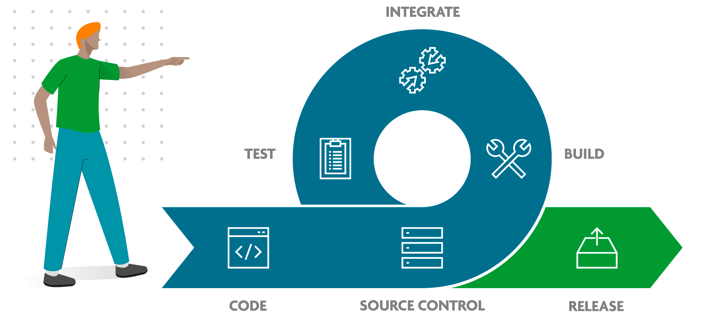

# Integração contínua

## Definição:

É o processo de intergrar modificações do codebase de forma contínua e automatizada,
evitando assim erros humanos de verificação, garantido mais agilidade e segurança no processo
de desenvolvimento de um software.

**Exemplos:**

## Principais processos

- Exercução de testes
- Linter
- Verificações de qualidade de código
- Verificações de segurança
- Geração de artefatos prontos para processo de deploy
- Identificação da próxmia versão a ser gerada no software
- Geração de tags

## Status check

É a garantia de que uma pull request não poderá ser mergeada ao repositório sem antes
ter passado pelo processo de CI ou mesmo no processo de code Review.

## Ferramentas populares

- Jenkins
- Github Actions
- Circle CI
- AWS code build
- Azure DevOps
- Google Cloud Build
- Gitlab pipelines/ CI

## Workflows

- São conjuntos de processos definidos para rodar na aplicação.
- É possivel ter mais do que um workflow por repositório
- Definifos em arquivos ".yml" em: .github/workflows
- Possui um ou mais "Jobs"